## Application Use Guide

### 1. Registration and Login 
- **Open the DANDELiON app and give permission to locate** 

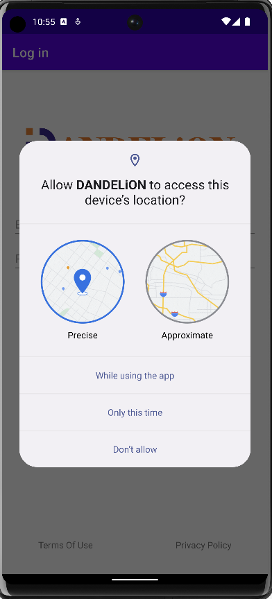  
Hint: The GPS location functionality is integrated with Google Maps' GPS feature and necessitates that users have the Google Maps app installed on their devices. Moreover, the location function is tied to pre-existing region and language settings, designed to enhance usability and user experience. If the GPS is turned off, the default language setting is English, which does not interfere with the overall app functionality. 

- **Login Page** 

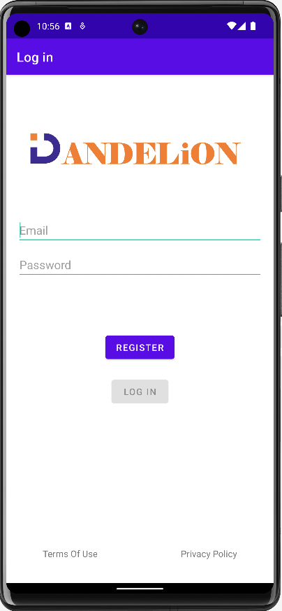  
Hint: Input your valid email address and password, then click on the "Login" button to finalize the login process. If you're a new user, select the 'Register' button to proceed to the registration screen.

- **Register Page** 

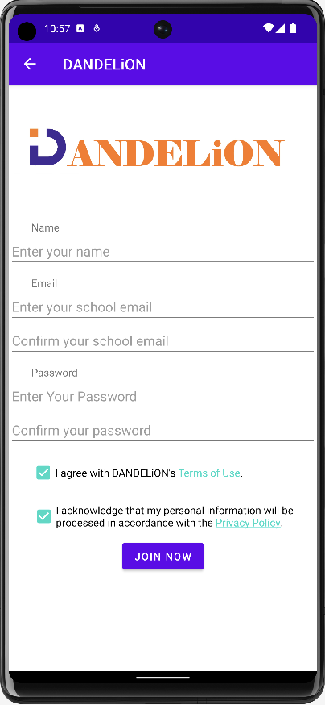  
Hint: Follow the steps to input your name, email, and password, then carefully read the terms of use and privacy policy. Check the box to acknowledge and agree to these terms. The check box click is mandatory. Ensure that all necessary information is provided to finalize the registration process. Once completed, you'll be automatically redirected to the main page. 

### 2. Navigation and Settings
- **Navigation Page** 

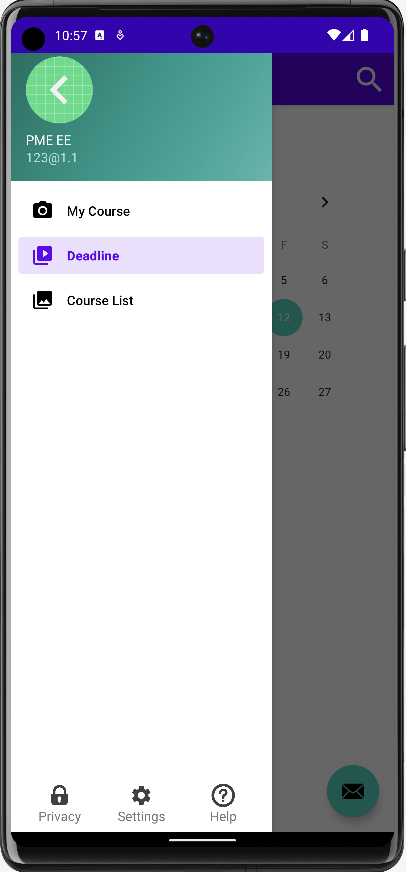  
Hint: The top of the navigation bar displays personal information, including a randomly assigned avatar, name, and email. This section is display-only and does not support clicking or editing. To change these details, navigate to the Settings screen. The middle section of the navigation bar provides links to three sub-pages, which can be accessed by clicking on them according to your needs. The bottom half of the navigation bar features support buttons for Privacy, Settings, and Help. You can click on these buttons to navigate to the respective pages as needed. 

- **Settings Page** 

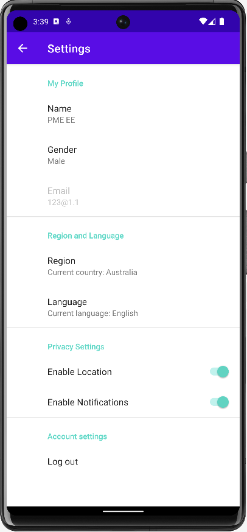  
Hint: On the settings page, you can modify all personal information with the exception of your email address, which is fixed and unique. Both region and language settings can be manually adjusted, and privacy preferences can be customized. Additionally, you have the option to log out of your account from this page.

### 2. Main Page
- **Deadline Page** 

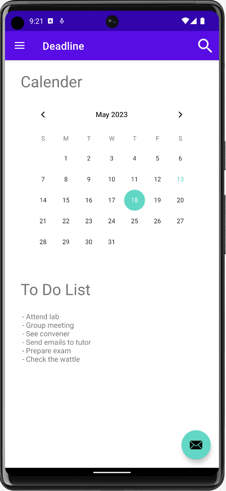  
Hint: The Deadline page serves as the main page of this app, primarily functioning as a reminder tool. By clicking on a specific date in the calendar, the to-do list for that day will appear in the lower half of the page.

- **Course List Page** 

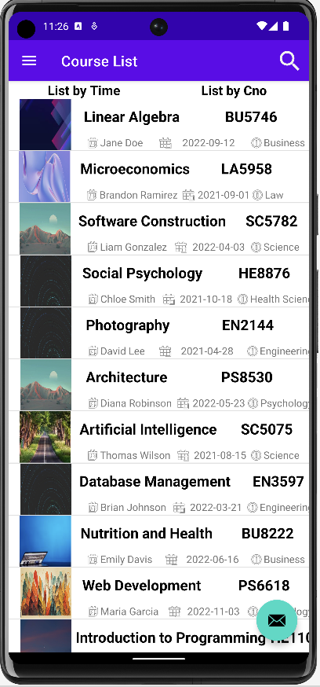  
Hint: The course page displays all courses available in the database. At the top of the page, you can sort the courses by either time or course number (cno). Clicking on a specific course card will redirect you to a detailed information page for that course. Located in the upper right corner is an icon shaped like a magnifying glass, which serves as a search button. Click on it to navigate to the course search page.

- **Course Information Page** 

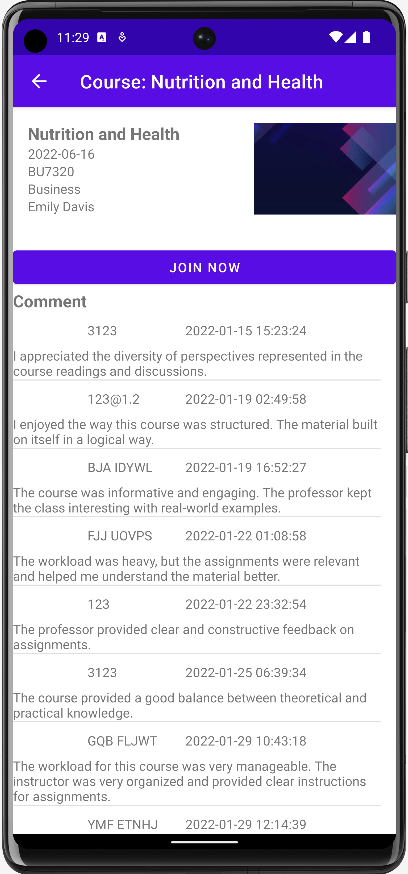 
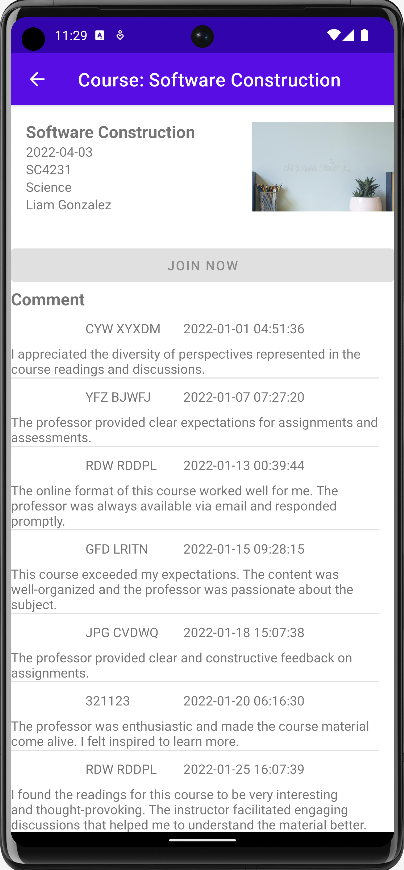  
Hint: The course information page provides detailed course content and comment. If you've already joined a course, the "Join Now" button will be unclickable. However, if you haven't yet joined a course, you can do so by clicking the "Join Now" button.

- **Search Page** 

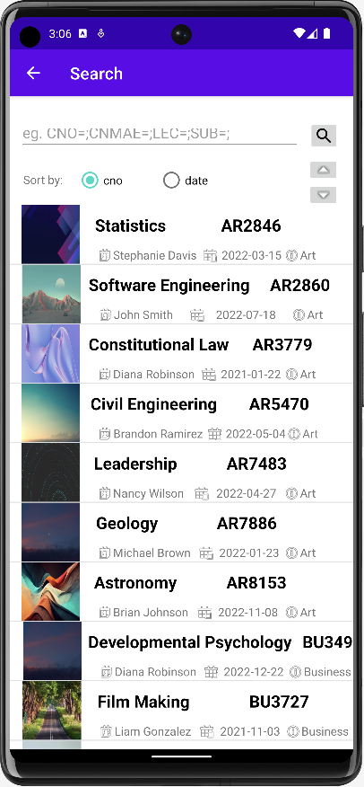  
Hint: Enter the information you need to search by format in the search box to complete the function of exact search and fuzzy search. A pop-up window will appear to show the number of search results, or you can click the key at the top to sort the search results.

- **My Course Page** 

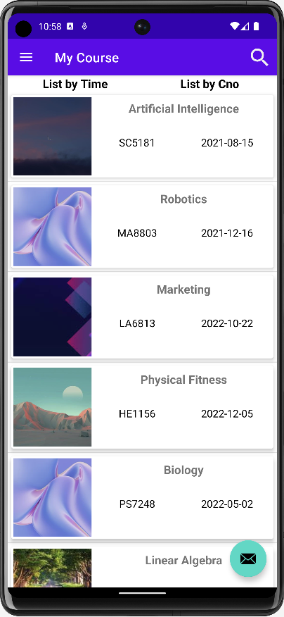  
Hint: The "My Courses" section displays all courses that you have enrolled in. Clicking on a specific course card will take you to the content page for that course. Courses can also be sorted by course number or time for your convenience.

- **Course Content Page** 

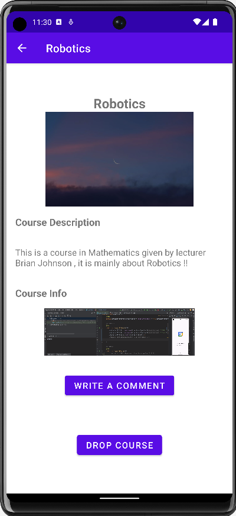  
Hint: The course content page showcases detailed course information and course videos, providing a platform for users to study. In terms of practicality, only users who have joined the course are permitted to post comments. Once a comment is posted, it becomes visible to other users on the course information page. This page also includes a feature to drop the course. By clicking the "Drop Course" button, you can opt-out of the course. 

### 3. Peer-to-Peer Page

- **Peer-to-Peer Icon** 

  
Hint: In the bottom right corner of the three sub-pages, you'll find an icon as depicted in the image. Click on this icon to navigate to the chat screen. 

- **Contact List Page** 

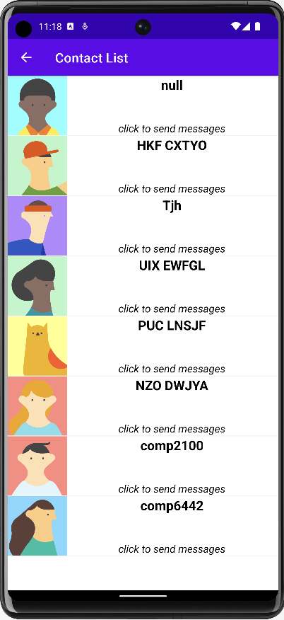  
Hint: In the contact list, you'll see cards representing different users. To engage in real-time chat with these users, you both must be participants in the same course. Click on a user's card to open the corresponding chat window. 

- **Personal Contact Page** 

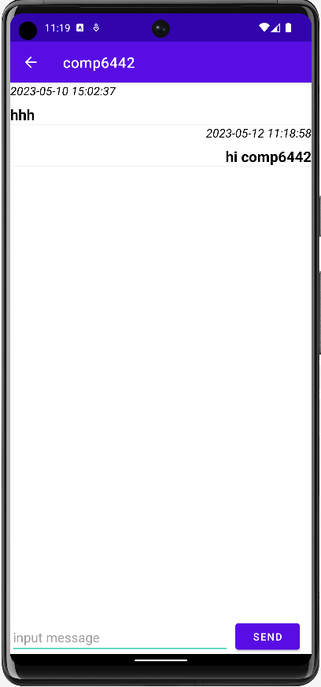  
Hint:Within the chat window, you can carry out one-on-one, private, real-time conversations. Messages can be sent directly to the other user, who will receive them instantly. Additionally, all chat history is stored for future reference. 

